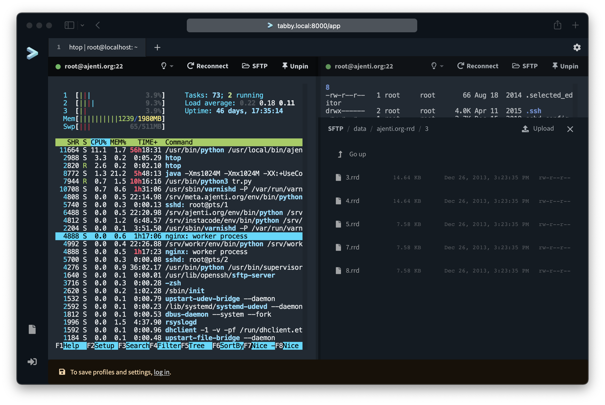

# Tabby Web

## Note on project status

> [!IMPORTANT]  
> At this time I don't have the time to work on `tabby-web` and won't be able to provide help or support for it. I'm still happy to merge any fixes/improvement PRs. :v:




This is the Tabby terminal, served as a web app. It also provides the config sync service for the Tabby app.

# How it works

Tabby Web serves the [Tabby Terminal](https://github.com/Eugeny/tabby) as a web application while managing multiple config files, authentication, and providing TCP connections via a [separate gateway service](https://github.com/Eugeny/tabby-connection-gateway).

# Documentation

- **[Deployment Guide](docs/DEPLOYMENT.md)** - Complete guide for production deployment
- **[Connection Gateway](https://github.com/Eugeny/tabby-connection-gateway)** - For SSH/Telnet connections

# Requirements

## Software Requirements

* Python 3.10+ (3.12 recommended)
* Node.js 18+ (for frontend build)
* A database server supported by Django (MariaDB, Postgres, SQLite, etc.)
* Storage for distribution files - local, S3, GCS or others supported by `fsspec`
* Docker and Docker Compose (for containerized deployment)

## System Requirements

### Minimum (Build & Run)

| Resource | Requirement |
|----------|-------------|
| CPU | 2 cores |
| RAM | 2GB (4GB recommended for building) |
| Disk | 5GB |

> **Note:** Building the Docker image requires significant memory for the frontend compilation step. If you're running on a memory-constrained system (like Oracle Cloud Free Tier), consider using a pre-built image or building on a machine with more RAM.

### Runtime Only (Pre-built Image)

| Resource | Requirement |
|----------|-------------|
| CPU | 1 core |
| RAM | 512MB |
| Disk | 1GB + app distributions |

### Recommended (Production)

| Resource | Requirement |
|----------|-------------|
| CPU | 2+ cores |
| RAM | 2GB |
| Disk | 10GB |

## Docker Build Requirements

Building the Docker image requires significant resources due to the frontend compilation:

| Resource | Minimum | Recommended |
|----------|---------|-------------|
| RAM | 2 GB | 4 GB |
| CPU | 2 cores | 4 cores |
| Disk | 5 GB | 10 GB |

**Note:** The frontend build (webpack/Angular) is memory-intensive. If building on constrained systems (like Oracle Cloud Always Free tier with 1GB RAM), consider:
- Using pre-built images from a CI/CD pipeline
- Building on a larger machine and pushing to a registry
- Adding swap space (not recommended for production)

# Quickstart (using `docker-compose`)

You'll need:

* OAuth credentials from GitHub, GitLab, Google or Microsoft for authentication.
* For SSH and Telnet: a [`tabby-connection-gateway`](https://github.com/Eugeny/tabby-connection-gateway) to forward traffic.

## Option 1: Pre-built Image (Recommended)

Use the pre-built image from GitHub Container Registry - no build required:

```bash
docker-compose -f docker-compose.prebuilt.yml up -d
```

The image is available at `ghcr.io/eugeny/tabby-web:latest`.

## Option 2: Build from Source

If you need to customize the build:

```bash
export DOCKER_BUILDKIT=1
docker-compose up -d
```

---

Both options will start Tabby Web on port 9090 with MariaDB as a storage backend.

For SSH and Telnet, once logged in, enter your connection gateway address and auth token in the settings.

## Environment variables

* `DATABASE_URL` (required).
* `APP_DIST_STORAGE`: a `file://`, `s3://`, or `gcs://` URL to store app distros in.

### Authentication Providers

Only providers with credentials configured will appear as login options. Set the following environment variables for each provider you want to enable:

| Provider | Environment Variables |
|----------|----------------------|
| GitHub | `SOCIAL_AUTH_GITHUB_KEY`, `SOCIAL_AUTH_GITHUB_SECRET` |
| GitLab | `SOCIAL_AUTH_GITLAB_KEY`, `SOCIAL_AUTH_GITLAB_SECRET` |
| Google | `SOCIAL_AUTH_GOOGLE_OAUTH2_KEY`, `SOCIAL_AUTH_GOOGLE_OAUTH2_SECRET` |
| Microsoft (multi-tenant) | `SOCIAL_AUTH_MICROSOFT_GRAPH_KEY`, `SOCIAL_AUTH_MICROSOFT_GRAPH_SECRET` |
| Azure AD (single-tenant) | `SOCIAL_AUTH_AZUREAD_TENANT_OAUTH2_KEY`, `SOCIAL_AUTH_AZUREAD_TENANT_OAUTH2_SECRET`, `SOCIAL_AUTH_AZUREAD_TENANT_OAUTH2_TENANT_ID` |
| Auth0 | `SOCIAL_AUTH_AUTH0_DOMAIN`, `SOCIAL_AUTH_AUTH0_KEY`, `SOCIAL_AUTH_AUTH0_SECRET` |
| Generic OIDC | `SOCIAL_AUTH_OIDC_OIDC_ENDPOINT`, `SOCIAL_AUTH_OIDC_KEY`, `SOCIAL_AUTH_OIDC_SECRET` |

For Auth0, set the callback URL to: `https://your-domain/api/1/auth/social/complete/auth0/`

### Generic OIDC Provider

The generic OIDC provider works with any OpenID Connect compliant identity provider, including:
- **Authentik** - Self-hosted identity provider
- **Authelia** - Self-hosted authentication server
- **Keycloak** - Open source identity management
- **Okta** - Enterprise identity platform
- And any other OIDC-compliant provider

Configuration:
- `SOCIAL_AUTH_OIDC_OIDC_ENDPOINT`: The OIDC discovery endpoint (e.g., `https://authentik.example.com/application/o/<app-slug>/`)
- `SOCIAL_AUTH_OIDC_KEY`: Client ID from your identity provider
- `SOCIAL_AUTH_OIDC_SECRET`: Client secret from your identity provider
- `SOCIAL_AUTH_OIDC_NAME` (optional): Custom button text (default: "SSO")

Set the callback URL to: `https://your-domain/api/1/auth/social/complete/oidc/`

**Note on MFA:** Multi-factor authentication is handled by your identity provider. Enable MFA in Authentik, Authelia, or your chosen provider to require 2FA for Tabby Web logins.

### Azure AD Single-Tenant

For organizations that want to restrict login to a specific Azure AD/Entra ID tenant (instead of allowing any Microsoft account), use the Azure AD single-tenant provider:

- `SOCIAL_AUTH_AZUREAD_TENANT_OAUTH2_KEY`: Application (client) ID from Azure portal
- `SOCIAL_AUTH_AZUREAD_TENANT_OAUTH2_SECRET`: Client secret
- `SOCIAL_AUTH_AZUREAD_TENANT_OAUTH2_TENANT_ID`: Directory (tenant) ID

Set the callback URL to: `https://your-domain/api/1/auth/social/complete/azuread-tenant-oauth2/`

When registering your app in Azure portal, select "Accounts in this organizational directory only" for supported account types.

## Adding Tabby app versions

* `docker-compose run tabby /manage.sh add_version 1.0.163`

You can find the available version numbers [here](https://www.npmjs.com/package/tabby-web-container).

# Development setup

Put your environment vars (`DATABASE_URL`, etc.) in the `.env` file in the root of the repo.

For the frontend:

```shell
cd frontend
yarn
yarn run build # or yarn run watch
```

For the backend:

```shell
cd backend
poetry install
./manage.py migrate # set up the database
./manage.py add_version 1.0.156-nightly.2 # install an app distribution
PORT=9000 poetry run gunicorn # optionally with --reload
```

# Security

* When using Tabby Web for SSH/Telnet connectivity, your traffic will pass through a hosted gateway service. It's encrypted in transit (HTTPS) and the gateway servers authenticate themselves with a certificate before connections are made. However there's a non-zero risk of a MITM if a gateway service is compromised and the attacker gains access to the service's private key.
* You can alleviate this risk by [hosting your own gateway service](https://github.com/Eugeny/tabby-connection-gateway), or your own copy of Tabby Web altogether.
